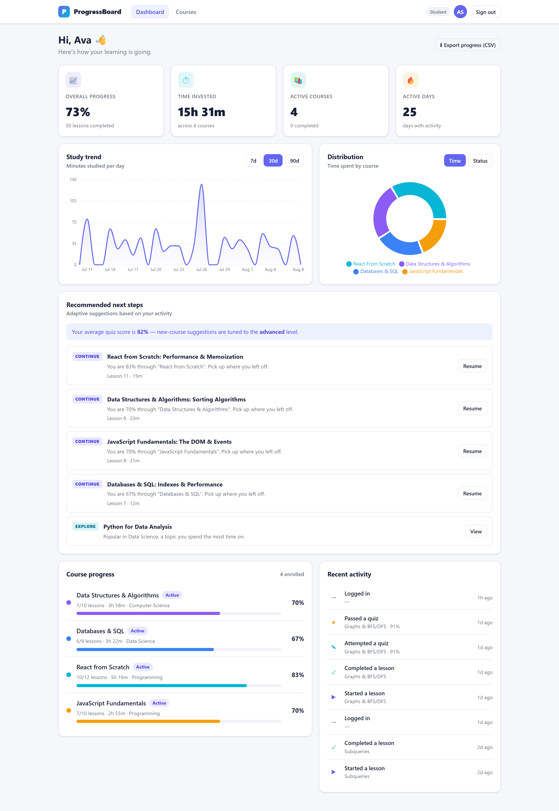
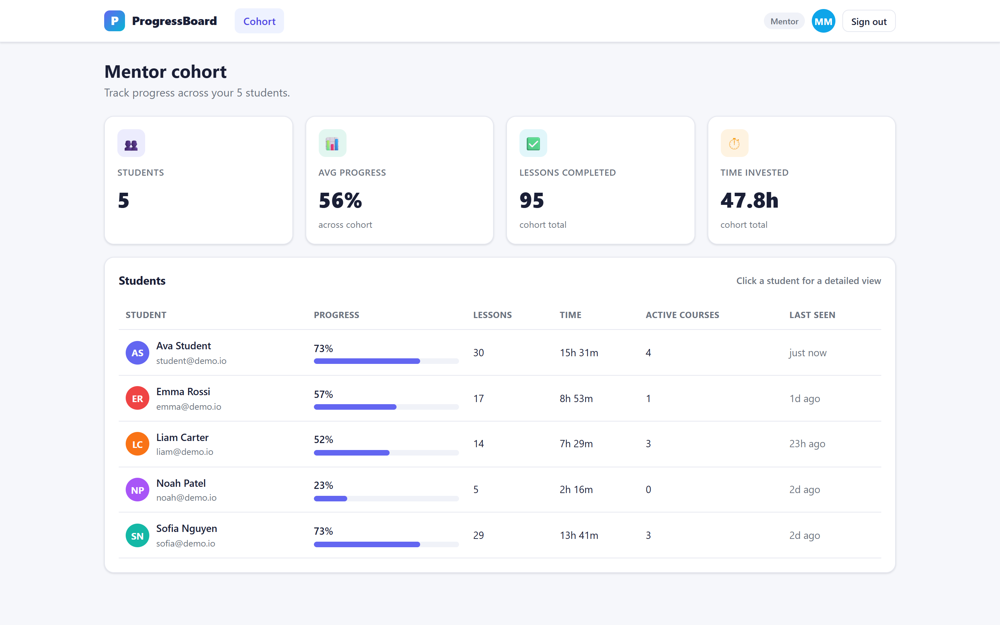
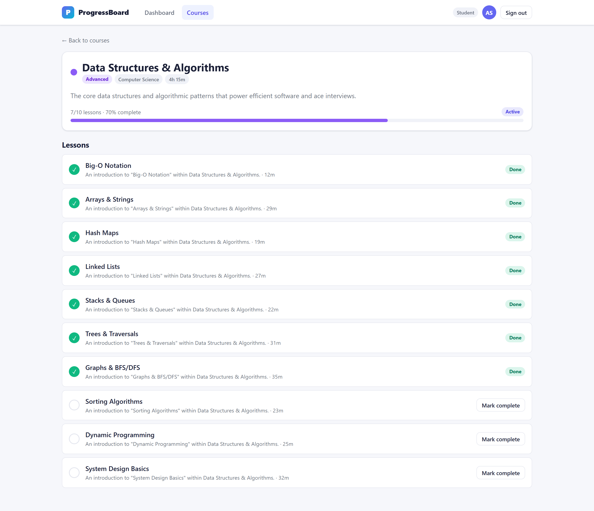
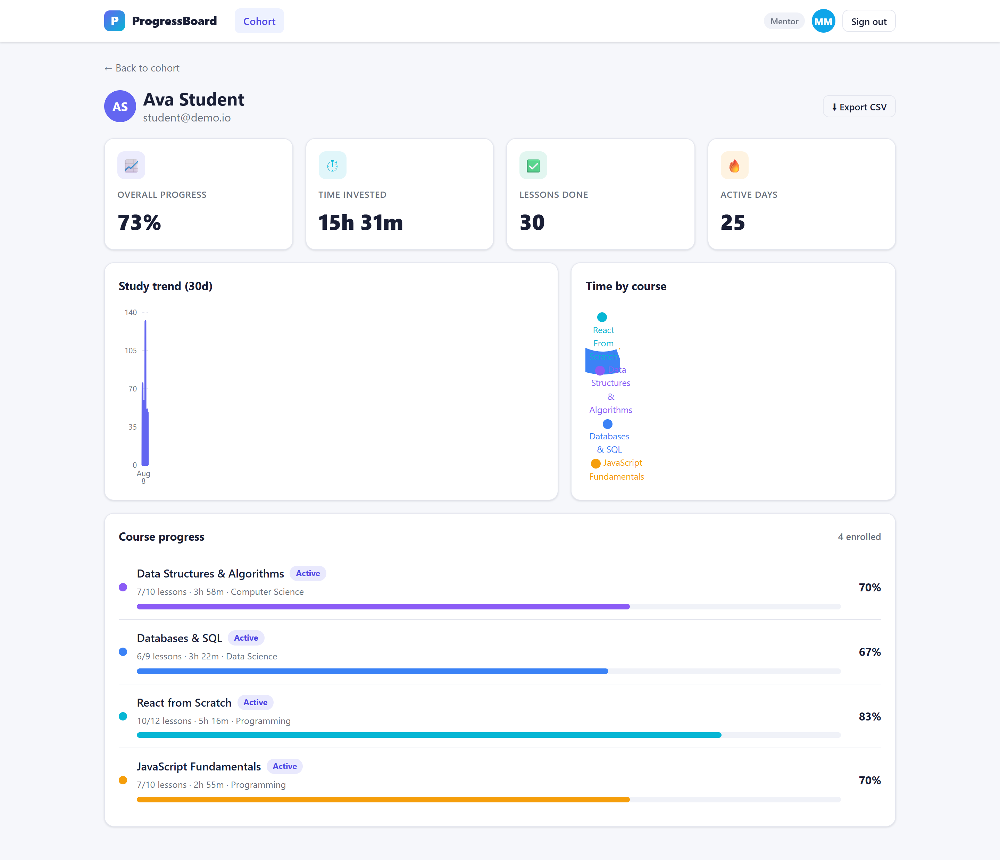
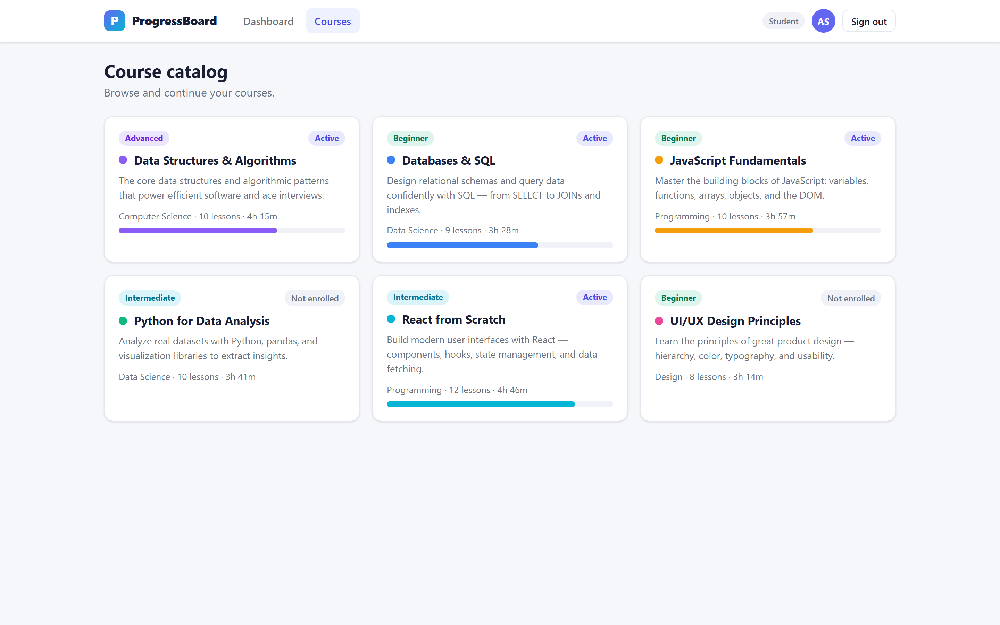
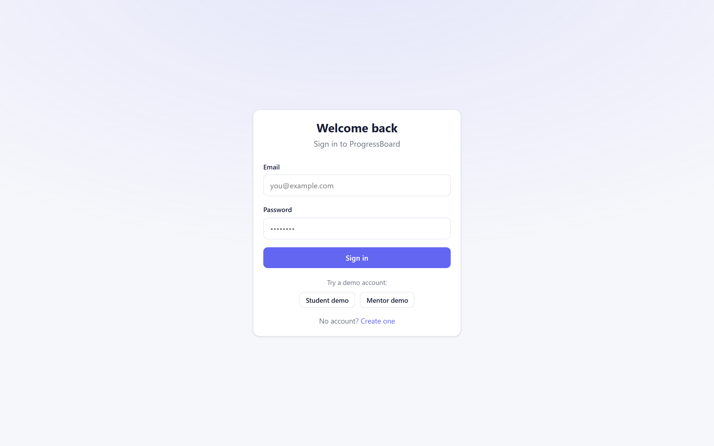
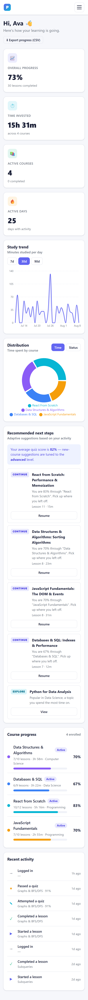
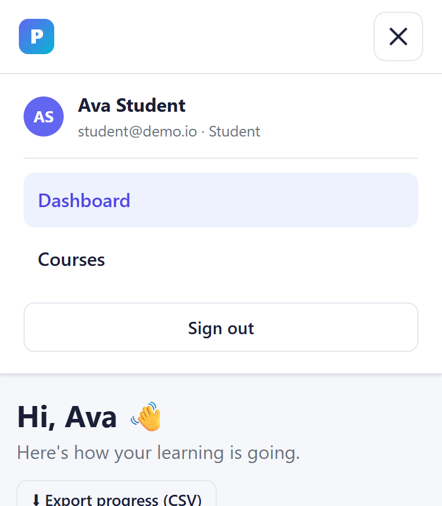
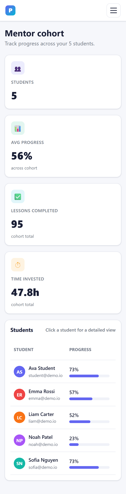
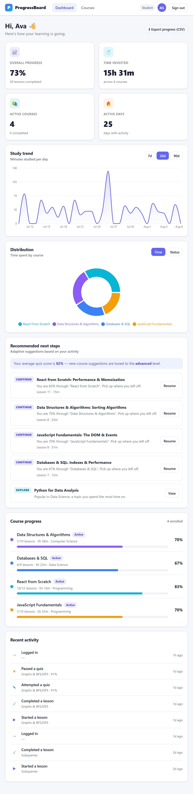

# 📊 Progressive Student Dashboard (MERN)

A production-ready full-stack web application that tracks student progress across
courses, recommends adaptive next steps, and visualizes learning insights for both
**students** and **mentors**.

Built with the **MERN** stack — **M**ongoDB, **E**xpress, **R**eact, **N**ode.js.

> Challenge 1 — *Progressive Student Dashboard*. This repo implements **all core
> features and every stretch goal**: adaptive recommendations, CSV export, mentor
> dashboards, an automated test suite, and a fully responsive UI.

---

## Table of contents

- [Screenshots](#-screenshots)
- [Feature checklist](#-feature-checklist)
- [Tech stack](#-tech-stack)
- [Architecture](#-architecture)
- [Quick start](#-quick-start)
- [Demo accounts](#-demo-accounts)
- [Data model](#-data-model)
- [How analytics work](#-how-analytics-work)
- [The recommendation engine](#-the-recommendation-engine)
- [Testing](#-testing)
- [Project structure](#-project-structure)
- [API documentation](#-api-documentation)
- [Configuration](#-configuration)
- [Deliverables](#-deliverables)

---

## 🖼 Screenshots

| Student dashboard | Mentor cohort |
|---|---|
|  |  |

| Course detail | Mentor — student detail |
|---|---|
|  |  |

| Course catalog | Login |
|---|---|
|  |  |

### Fully responsive

The layout reflows from desktop → tablet → phone, and the navbar collapses into a
hamburger menu below 640px.

| Mobile dashboard | Mobile menu | Mobile mentor | Tablet dashboard |
|---|---|---|---|
|  |  |  |  |

---

## ✅ Feature checklist

### Core features
- [x] **Email authentication** with hashed passwords (bcrypt) and JWT sessions
- [x] **Two roles** — `student` and `mentor` — with role-based access control
- [x] **Dashboard** showing completed lessons, time spent, and progress per course
- [x] **Trend chart** — time-series of minutes studied per day (7 / 30 / 90 day ranges)
- [x] **Pie / donut chart** — distribution of time per course **and** completion status
- [x] **Backend API** for auth, aggregates & time-series, lesson details, and activity events
- [x] **Seeded sample data** + clear setup instructions

### Stretch features
- [x] **Adaptive recommendations** — "continue", "revisit", and difficulty-matched "explore"
- [x] **Export to CSV** — course progress and time-series (student & mentor)
- [x] **Mentor dashboards** — cohort roll-up + per-student deep dives
- [x] **Tests** — 12 backend integration tests (Jest + Supertest + in-memory MongoDB)
- [x] **Fully responsive UI** — reflows desktop → tablet → phone, hamburger nav below 640px, dark-mode aware

---

## 🧱 Tech stack

| Layer | Technology |
|---|---|
| Database | MongoDB + Mongoose ODM |
| Backend | Node.js, Express 4 |
| Auth | JWT (`jsonwebtoken`) + `bcryptjs`, httpOnly cookie **or** bearer token |
| Security | Helmet, CORS, express-rate-limit, input validation (express-validator) |
| Frontend | React 18 + Vite 5 |
| Routing | React Router 6 |
| Charts | Recharts |
| HTTP | Axios |
| Testing | Jest, Supertest, mongodb-memory-server |

---

## 🏗 Architecture

```
┌─────────────────┐     HTTP (JWT)      ┌──────────────────────┐      ┌───────────┐
│   React (Vite)  │  ───────────────▶   │   Express REST API   │ ───▶ │  MongoDB  │
│  SPA @ :5173    │  ◀───────────────   │       @ :5000        │ ◀─── │  @ :27017 │
└─────────────────┘     JSON / CSV      └──────────────────────┘      └───────────┘
        │                                          │
        │ Recharts visualizations                  │ Aggregation pipelines
        │ Auth context + protected routes          │ (summary, time-series, distribution)
        ▼                                          ▼
   Dashboard / Courses / Mentor            Services: aggregation + recommendations
```

The **single source of truth** for analytics is the `ActivityEvent` stream. Every
lesson completion, quiz attempt, and login is recorded as an event; dashboard
KPIs, trend charts, and distributions are computed from those events with MongoDB
aggregation pipelines. The `Enrollment` document keeps denormalized counters
(completed lessons, total time) in sync on each write for fast reads.

---

## 🚀 Quick start

### Prerequisites
- **Node.js** ≥ 18 (tested on v24)
- **MongoDB** running locally on `:27017` — or use the included Docker Compose

### Option A — run locally (recommended for development)

```bash
# 1. Clone and enter the repo
cd hackathon

# 2. Backend
cd server
cp .env.example .env            # then edit JWT_SECRET
npm install
npm run seed                    # loads courses, users & ~287 activity events
npm run dev                     # API on http://localhost:5000

# 3. Frontend (in a second terminal)
cd client
cp .env.example .env
npm install
npm run dev                     # app on http://localhost:5173
```

Open **http://localhost:5173** and sign in with a demo account below.

> The Vite dev server proxies `/api` → `http://localhost:5000`, so no CORS setup
> is required in development.

### Option B — Docker Compose (MongoDB + API)

```bash
docker compose up --build       # starts MongoDB + API
# then, in another terminal, seed the database:
docker compose exec server npm run seed
# run the frontend locally against the containerized API:
cd client && npm install && npm run dev
```

### Option C — MongoDB via Docker only

If you don't have MongoDB installed, start just the database:

```bash
docker run -d --name psd-mongo -p 27017:27017 mongo:7
```
…then follow **Option A**.

---

## 🔑 Demo accounts

After running `npm run seed`, all accounts share the password **`Password123`**.

| Role | Email | Notes |
|---|---|---|
| 🎓 Student | `student@demo.io` | **Primary demo** — rich activity, 4 courses, avg quiz 82% |
| 🎓 Student | `sofia@demo.io` | High engagement |
| 🎓 Student | `liam@demo.io` | Medium engagement |
| 🎓 Student | `emma@demo.io` | Medium engagement |
| 🎓 Student | `noah@demo.io` | Low engagement (good for "revisit" recs) |
| 🧭 Mentor | `mentor@demo.io` | Mentors all five students |

The login screen has one-click **"Student demo"** / **"Mentor demo"** buttons that
pre-fill credentials.

---

## 🗃 Data model

```
User          { name, email, passwordHash, role: student|mentor, mentor→User, avatarColor }
Course        { title, slug, category, difficulty, tags, color, totalLessons, estimatedMinutes }
Lesson        { course→Course, title, order, summary, content, estimatedMinutes, difficulty }
Enrollment    { student→User, course→Course, status, completedLessons[], totalTimeMinutes, lastActivityAt }
ActivityEvent { student→User, course→Course, lesson→Lesson, type, durationMinutes, score, occurredAt }
```

`ActivityEvent.type` ∈ `lesson_started | lesson_completed | quiz_attempt | quiz_passed | video_watched | login`.

---

## 📈 How analytics work

All dashboard numbers are derived with MongoDB aggregation pipelines in
[`server/src/services/aggregationService.js`](server/src/services/aggregationService.js):

- **Summary KPIs** — total time (`$sum durationMinutes`), completed lessons (count of
  `lesson_completed` events), active/completed course counts, distinct active days.
- **Time-series** — events grouped by UTC day; the API returns a *dense* series
  (gaps filled with zeros) so the chart has a continuous x-axis.
- **Distribution** — time grouped per course (`$group` + `$lookup`) for the donut, or
  enrollment counts grouped by status.

---

## 🧠 The recommendation engine

[`server/src/services/recommendationService.js`](server/src/services/recommendationService.js)
blends several signals and returns ranked, de-duplicated suggestions:

1. **Continue** — the next uncompleted lesson in an active course (highest priority,
   weighted by how close the course is to completion).
2. **Revisit** — active courses with no activity in 7+ days (re-engagement nudge).
3. **Explore** — new courses in the categories the student spends the most time in,
   **difficulty-adapted** from the student's average quiz score:
   - avg ≥ 80 → recommend `advanced`
   - avg ≥ 55 → recommend `intermediate`
   - otherwise → recommend `beginner`

The response also exposes the `adaptiveSignal` (avg quiz score, target difficulty,
favored categories) which the UI surfaces to explain *why* it recommends what it does.

---

## 🧪 Testing

```bash
cd server
npm test                # runs the full suite against an in-memory MongoDB
npm run test:coverage   # with coverage report
```

The suite (12 tests) covers authentication, role-based access control, the full
activity→analytics flow (summary, per-course progress, time-series, distribution),
course auto-completion, CSV export, and the recommendation engine. It uses
`mongodb-memory-server`, so **no running database is required** to run tests.

```
PASS tests/dashboard.test.js
PASS tests/auth.test.js
PASS tests/rbac.test.js
Test Suites: 3 passed, 3 total
Tests:       12 passed, 12 total
```

---

## 📁 Project structure

```
hackathon/
├── README.md                 ← you are here
├── docker-compose.yml        ← MongoDB + API
├── docs/
│   ├── API.md                ← full REST API reference
│   └── screenshots/          ← UI screenshots
├── server/                   ← Express + Mongoose API
│   ├── src/
│   │   ├── config/           ← env + db connection
│   │   ├── models/           ← Mongoose schemas
│   │   ├── middleware/       ← auth, validation, error handling
│   │   ├── controllers/      ← request handlers
│   │   ├── routes/           ← Express routers
│   │   ├── services/         ← aggregation + recommendation logic
│   │   ├── utils/            ← JWT, CSV, ApiError
│   │   ├── seed/             ← sample data + seed script
│   │   ├── app.js            ← express app factory
│   │   └── index.js          ← server bootstrap
│   └── tests/                ← Jest + Supertest suites
└── client/                   ← React + Vite SPA
    └── src/
        ├── api/              ← axios client
        ├── context/          ← auth context
        ├── components/       ← charts, cards, feeds, guards
        ├── pages/            ← Login, Register, Dashboard, Courses, Mentor…
        └── utils/            ← formatting helpers
```

---

## 📚 API documentation

Full request/response reference — including auth, error envelope, and every
endpoint with examples — lives in **[docs/API.md](docs/API.md)**.

Quick reference:

| Method | Endpoint | Role | Purpose |
|---|---|---|---|
| `POST` | `/api/auth/register` | public | Create account, returns JWT |
| `POST` | `/api/auth/login` | public | Log in, returns JWT |
| `GET` | `/api/auth/me` | any | Current user |
| `GET` | `/api/dashboard/summary` | student | KPI totals |
| `GET` | `/api/dashboard/course-progress` | student | Per-course progress |
| `GET` | `/api/dashboard/time-series?days=30` | student | Daily study minutes |
| `GET` | `/api/dashboard/distribution?by=time\|status` | student | Donut data |
| `GET` | `/api/dashboard/export?type=progress\|timeseries` | student | CSV download |
| `GET` | `/api/recommendations` | student | Adaptive next steps |
| `GET` | `/api/courses` | any | Course catalog |
| `GET` | `/api/courses/:id` | any | Course + lessons |
| `GET` | `/api/courses/:id/lessons/:lessonId` | any | Lesson detail |
| `POST` | `/api/courses/:id/enroll` | student | Enroll |
| `POST` | `/api/activities` | student | Record activity event |
| `GET` | `/api/activities` | student | Recent activity feed |
| `GET` | `/api/mentor/students` | mentor | Cohort roster + roll-up |
| `GET` | `/api/mentor/students/:id` | mentor | Student deep dive |
| `GET` | `/api/mentor/students/:id/export` | mentor | Student CSV |

---

## ⚙️ Configuration

### `server/.env`
| Variable | Default | Description |
|---|---|---|
| `NODE_ENV` | `development` | Environment |
| `PORT` | `5000` | API port |
| `MONGO_URI` | `mongodb://127.0.0.1:27017/student_dashboard` | Mongo connection |
| `JWT_SECRET` | *(required in prod)* | Secret for signing tokens |
| `JWT_EXPIRES_IN` | `7d` | Token lifetime |
| `CLIENT_ORIGIN` | `http://localhost:5173` | Allowed CORS origin |

In **production** the server refuses to start unless `JWT_SECRET` is set to a strong
(≥ 20 char) value and `MONGO_URI` is provided.

### `client/.env`
| Variable | Default | Description |
|---|---|---|
| `VITE_API_URL` | `/api` | API base (dev uses the Vite proxy) |

---

## 📦 Deliverables

- ✅ **Full-stack repo** — `server/` + `client/`
- ✅ **Seed data** — `npm run seed` (6 courses, 6 users, ~287 activity events)
- ✅ **API documentation** — [docs/API.md](docs/API.md)
- ✅ **Screenshots** — [docs/screenshots/](docs/screenshots/)
- ✅ **Tests** — `cd server && npm test`
- ✅ **Setup instructions** — this README

---

## 📝 License

MIT — free to use for evaluation and learning.
